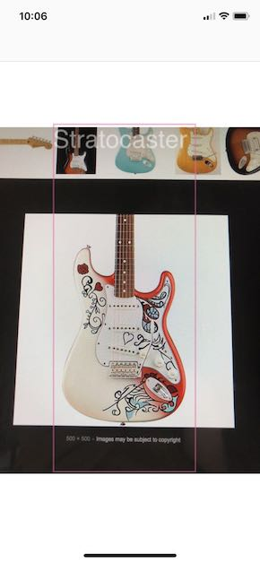
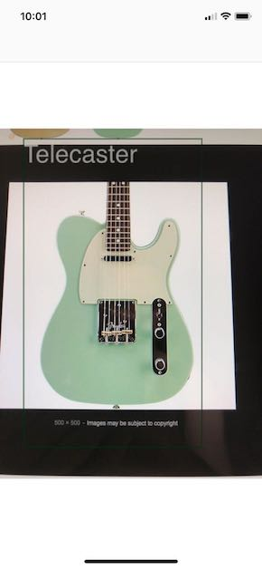
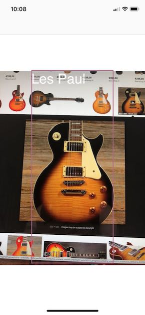

# Guitar classifier app

<div>
    
    
    
</div>

## Description

This is an iOS app that identifies three basic guitar types: Stratocaster, Telecaster and Les Paul. It does this by using a custom made machine learning model (mlmodel). The code and the steps for creating this file is also attached, please look at the instructions below and go to the scripts/ folder. We use turi software (github.com/apple/turicreate) for this. The model created is a neural network trained with a set of guitar images. Inspiration taken from github.com/ichibod.

## Install

* Gather images with googleimagesdownload (github.com/hardikvasa/google-images-download). If you want to download more than 100 images (the more the better the model will be), you must install chromedriver (chromedriver.chromium.org). Run the second commad every time with a different guitar type (replace "Telecaster" on all occurrences on it).

  ```
	cd GuitarIdentifier/scripts
	googleimagesdownload -k "Telecaster" -l 30 -o dataset/images/ -cd /Applications/chromedriver -s medium && mv dataset/images/Telecaster/* dataset/images && rmdir dataset/images/Telecaster/
  ```

* Frame and label these images with simple_image_annotator (github.com/sgp715/simple_image_annotator). Open your chrome browser on http://127.0.0.1:5000/tagger. If you have installed it on same level as GuitarIdentifier:

  ```
	cd ../../simple_image_annotator && python app.py ../GuitarIdentifier/scripts/dataset/images/ --out ../GuitarIdentifier/scripts/images-data.csv && cd ../GuitarIdentifier/scripts/
  ```

*  Create the mlmodel file by running main.py. It should open a turi file where you should see the images with the frames on top of them:

  ```
	python main.py
  ```

* Open the app on xcode. Drag the mlmodel file to the project folder and run it. It uses the camera therefore needs to run on a real device

## Running it with GPU

When running Neural Networks to create mlmodel files with turicreate, running it on GPU is several factos faster than doing it on CPU (in my case 6x faster). If you dont own a machine where turicreate can be run on a GPU, I strongly suggest to run the scripts on a cloud instance. I followed this tutorial for EC2 instances on AWS:

https://www.pyimagesearch.com/2017/09/20/pre-configured-amazon-aws-deep-learning-ami-with-python/

## System requirements

This is a list of the platform and the software versions I installed for creating the mlmodel and running the app.

* macOS 10.13
* python 2.7
* Turi Create 4.3.2
* ChromeDriver 2.39
* simple_image_annotator and googleimagesdownload dont have a release version
* iOS 11.4
* Xcode 9.4